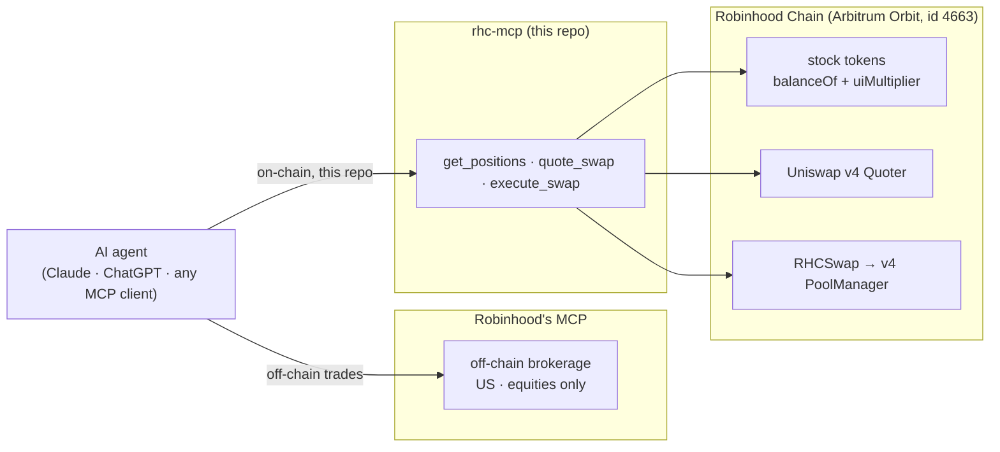

# rhc-mcp

**An MCP server for Robinhood Chain — the on-chain agentic surface Robinhood's own agent can't reach.**

Robinhood's [Agentic Trading](https://robinhood.com/us/en/agentic-trading/) exposes an MCP server so
any Claude / ChatGPT / MCP agent can trade — but it's **off-chain, US-only, equities-only**. It can't
see or touch the tokenized [Robinhood Chain](https://robinhood.com/us/en/chain/) **stock tokens**.

`rhc-mcp` is the complement: point any MCP-speaking agent at Robinhood *Chain* and let it **read
on-chain stock-token positions, see the real total-return value ERC-20 reads hide, quote, and swap** —
over the same Model Context Protocol. Read tools need no key; swapping is off by default and heavily
guarded.

Built on [RHCSwap](https://github.com/jumpboxtech/rhcswap), which routes around the chain's modified
UniversalRouter by talking to the Uniswap v4 PoolManager directly.

---

## How it fits



## Tools

| Tool | Access | What it does |
| --- | --- | --- |
| `rhc_info` | read | Chain / RPC / contract addresses; reports whether swapping is enabled or read-only. |
| `get_positions` | read | A wallet's stock-token positions: raw balance, `uiMultiplier`, the real total-return balance (`raw × multiplier ÷ 1e18`), and the accrued appreciation % that raw ERC-20 reads hide. |
| `quote_swap` | read | Exact-input single-hop quote via the Uniswap v4 Quoter. Proves the pool has liquidity and sizes `minAmountOut`. |
| `execute_swap` | **write** | Executes a swap via RHCSwap. Dry-run by default; guarded (see Safety). |

### The `uiMultiplier` insight

Stock tokens are [ERC-8056](https://robinhood.com/us/en/chain/) total-return tokens: raw `balanceOf`
is **static**, and `uiMultiplier()` (1e18-scaled) grows as in-kind dividends reinvest and on splits.
A naive ERC-20 balance read **understates** what a holder actually owns. `get_positions` surfaces both
and the gap between them — the on-chain yield an agent would otherwise miss.

## Install

```bash
git clone https://github.com/jumpboxtech/rhc-mcp && cd rhc-mcp
npm install && npm run build
cp .env.example .env   # edit for swapping; read tools need nothing
```

### Wire it to an agent

Claude Code:

```bash
claude mcp add rhc-mcp -- node /absolute/path/to/rhc-mcp/dist/index.js
```

Claude Desktop / any MCP client (`claude_desktop_config.json`):

```json
{
  "mcpServers": {
    "rhc-mcp": {
      "command": "node",
      "args": ["/absolute/path/to/rhc-mcp/dist/index.js"],
      "env": { "RHC_RPC_URL": "https://rpc.mainnet.chain.robinhood.com" }
    }
  }
}
```

Then ask your agent: *"What are my Robinhood Chain positions for 0x…?"* or *"Quote 1 NVDA to USDG."*

## Safety model

`execute_swap` moves real funds, so it is deliberately locked down:

- **Read-only by default** — with no `RHC_PRIVATE_KEY`, the server can only read; swaps are refused.
- **Key never touches the tool surface** — the signer comes only from `RHC_PRIVATE_KEY`, never a tool
  argument, and is never returned or logged.
- **Dry-run by default** — `execute_swap` returns the plan (expected out, enforced min out, recipient)
  without sending unless the caller passes `dryRun: false`.
- **Hard size cap** — `RHC_MAX_SWAP_AMOUNT` (whole input tokens, default `1`) bounds any single swap.
- **Slippage always enforced** — a real `minAmountOut` is required, taken from the argument or derived
  from a fresh quote minus `slippageBps`; the v4 price limit alone gives none.

## Configuration

| Env | Required for | Meaning |
| --- | --- | --- |
| `RHC_RPC_URL` | – | RPC endpoint (defaults to the public mainnet RPC). |
| `RHC_PRIVATE_KEY` | swapping | Signer key. Unset ⇒ read-only. Keep it in a real secret store. |
| `RHCSWAP_ADDRESS` | swapping | Deployed [RHCSwap](https://github.com/jumpboxtech/rhcswap) helper. |
| `RHC_MAX_SWAP_AMOUNT` | swapping | Per-swap input cap in whole tokens (default `1`). |

## Robinhood Chain addresses (chain id `4663`)

| Contract | Address |
| --- | --- |
| Uniswap v4 PoolManager | `0x8366a39CC670B4001A1121B8F6A443A643e40951` |
| StateView | `0xf3334192d15450cdd385c8b70e03f9a6bd9e673b` |
| Quoter | `0x8dc178efb8111bb0973dd9d722ebeff267c98f94` |

RPC: `https://rpc.mainnet.chain.robinhood.com` · Explorer: `robinhoodchain.blockscout.com`

## Scope & limits

Exact-input, single-hop, hookless pools — the same deliberate minimalism as RHCSwap. The known-token
registry is a small starter set (USDG, NVDA); pass any 0x address directly. Unaudited — read it before
you route funds through it.

## License

MIT © jumpbox — [jumpbox.tech](https://jumpbox.tech) · [@jumpbox_tech](https://x.com/jumpbox_tech)
